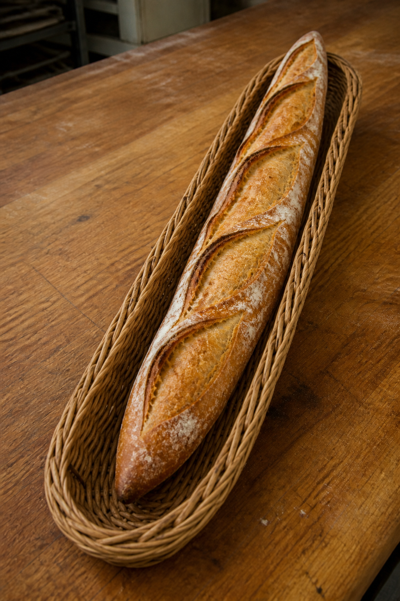
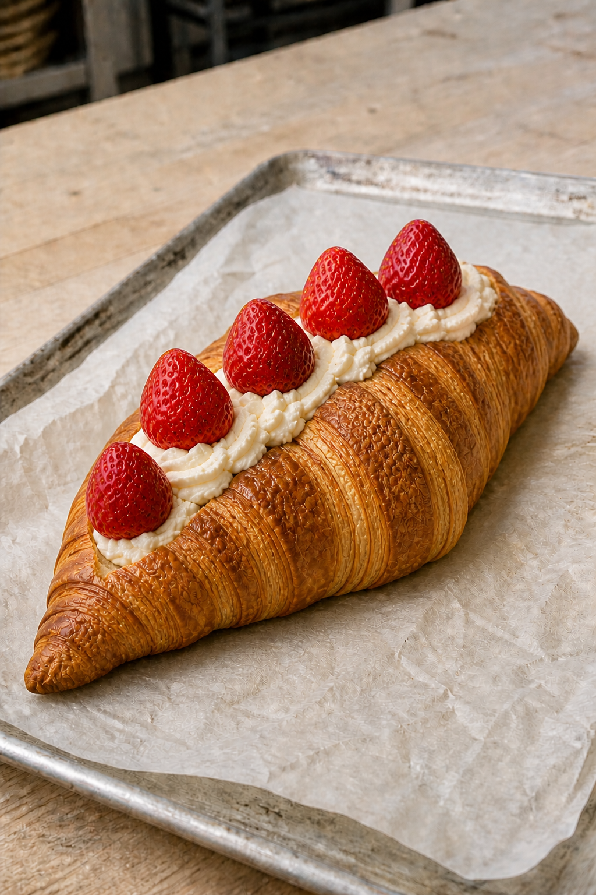
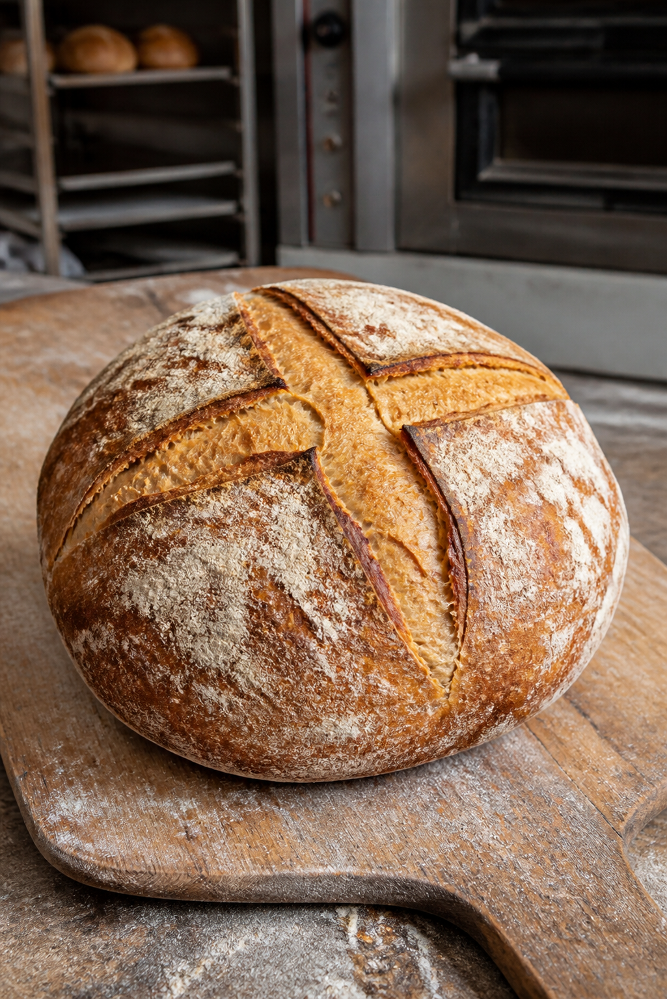

# minimirok 2026년 8월호 — 8.3-8.9

[← 아홉 개의 창으로 돌아가기](../README.md)

## No. 3. 바게트

길고 가는 생지 위로 겹쳐 열린 칼집과 얇고 바삭한 껍질을 길쭉한 라탄 바구니 안에 담은 바게트.

## No. 4. 마들렌

마들렌의 독특함은 은은한 레몬 제스트 향에 있습니다. 그 산뜻한 향이 부드러운 버터 풍미 사이로 가볍게 번지며, 작은 조개 모양의 빵을 무겁지 않게 마무리합니다.

## No. 5. 생크림 딸기 크루아상

크루아상의 묘미는 세상에서 가장 섬세한 겉바속촉에 있습니다. 오븐에서 나와 한김 식힌 크루아상의 윗면을 벌려 차가운 생크림을 채우고 잘 익은 딸기를 올리면, 고소함과 산뜻하고 부드러운 단맛이 차례로 겹쳐집니다.

## No. 6. 깜바뉴

깜바뉴의 매력은 소박한 재료가 긴 발효를 거치며 깊어지는 맛에 있습니다. 거칠게 갈라진 껍질은 단단하고 바삭하지만, 안쪽은 수분을 머금어 쫄깃하고 촉촉합니다. 씹을수록 밀의 구수함과 은은한 산미가 오래 남는, 하드빵의 가장 기본적인 형태입니다.

