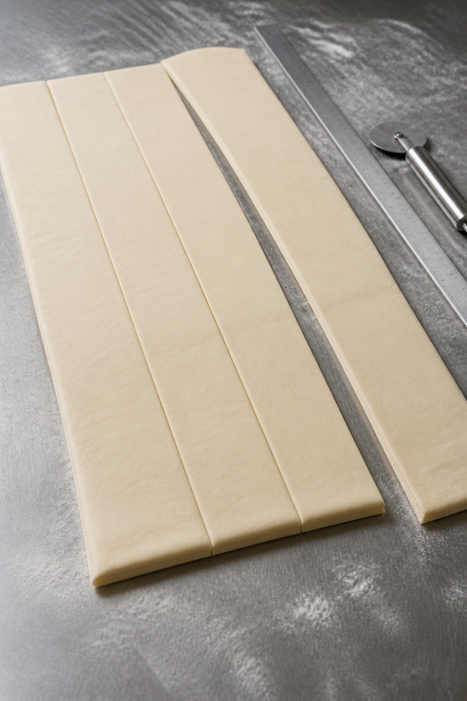
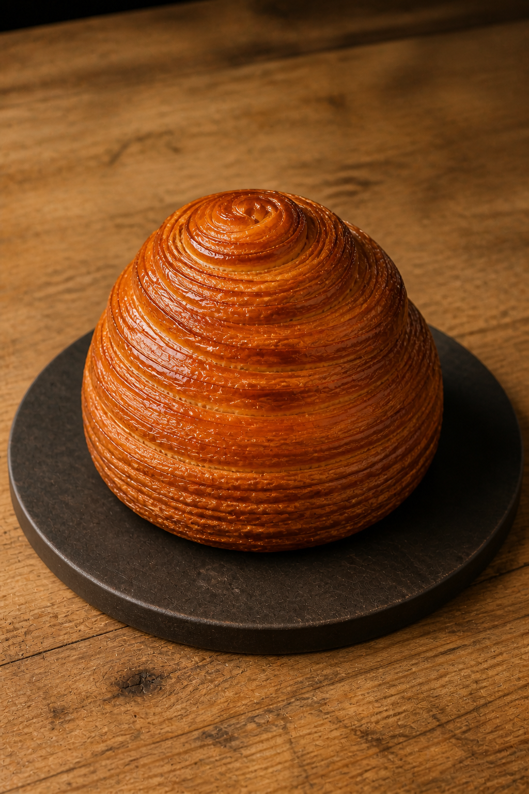
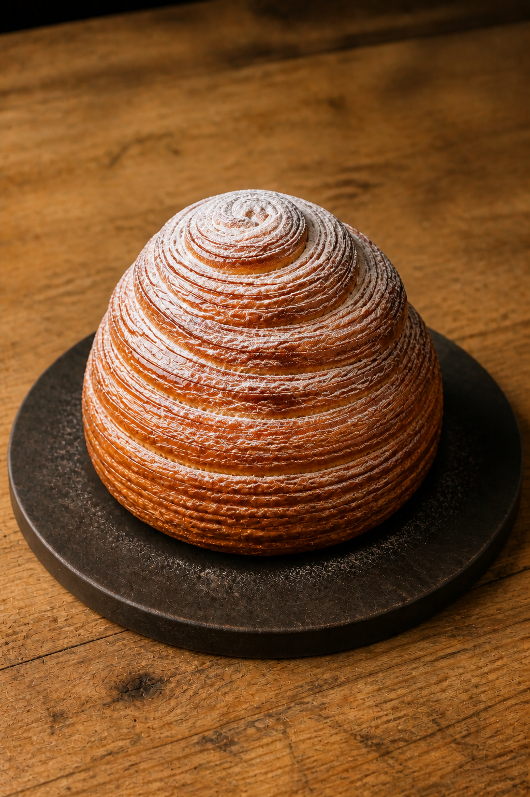

# No. 7. 눈꽃 몽블랑 — 몽블랑을 굽는 법

[← 2026년 8월호 메뉴](../../README.md) · [주차 목록](../README.md)

[잡지형 양면 편집으로 보기](../no-007_mont-blanc-spread.html)

몽블랑의 여정은 아직 산이라 부를 수 없는, 넓고 평평한 생지 한 장에서 시작됩니다. 차가운 버터를 품고 여러 번 접힐 때마다 반죽 안에는 보이지 않는 지층이 생깁니다. 생지는 길고 납작한 띠로 잘려 리본이 되고, 그 리본은 제 몸을 따라 나선형으로 감기며 천천히 산의 윤곽을 세웁니다. 발효의 시간 동안 고요히 숨을 모은 생지가 오븐의 문턱을 넘으면, 열과 수증기가 층 사이를 밀어 올립니다. 평평했던 반죽은 그제야 고도를 얻고 몽블랑이 됩니다.

몽블랑의 시작은 산이 아니라 한 장의 평평한 생지입니다. 버터를 접어 넣은 넓은 생지를 길고 납작한 띠로 나누면, 잘린 가장자리마다 얇은 반죽과 버터의 층이 차곡차곡 드러납니다. 둥근 줄처럼 보이지만 실은 공기를 품을 준비를 마친 페이스트리 리본입니다.

산은 오븐에 들어가기 전부터 이미 형태를 갖추고 있습니다. 차갑게 편 버터와 반죽을 길게 말아 올린 생지는 아직 창백하고 부드럽지만, 촘촘히 포개진 선 사이에는 곧 수증기가 밀어 올릴 수많은 빈자리가 준비되어 있습니다. 철판이 오븐의 문턱을 넘는 순간, 몽블랑의 첫 번째 고도가 시작됩니다.

오븐에서 막 나온 몽블랑은 작은 산 하나를 통째로 구워낸 모습입니다. 버터를 품은 반죽이 나선형 능선을 만들고, 그 위에 얇게 바른 설탕 시럽은 볕을 받은 바위처럼 반짝입니다. 손끝으로 한 겹을 건드리면 먼저 바삭한 소리가 나고, 곧이어 따뜻한 버터 향과 달콤한 윤기가 입안에 포개집니다.

빵칼로 정상에서부터 천천히 내려가면 비로소 산의 속이 열립니다. 단면에 겹겹이 이어진 커다란 빈 공간은 덜 채워진 자리가 아닙니다. 오븐의 열을 만난 수분이 수증기로 팽창하고, 버터가 반죽의 층과 층을 밀어내며 만든 가장 맛있는 공백입니다. 그래서 겉은 얇게 부서지고 속은 공기를 머금은 채 촉촉합니다. 몽블랑의 겉바속촉은 재료가 아니라 열과 압력, 시간으로 세운 지형입니다.

   
  Mont Blanc — 4,810 m

이 빵의 이름은 알프스의 흰 산, 몽블랑에서 왔습니다. 해발 4,810m로 기억되는 정상은 멀리서 보면 부드러운 흰 곡선이지만, 가까이 다가갈수록 바람과 얼음이 새긴 수많은 능선을 드러냅니다. 몽블랑 빵도 같습니다. 둥글고 달콤한 겉모습 안에 셀 수 없이 많은 결이 숨어 있고, 그 결 사이의 공기가 한입을 가볍게 들어 올립니다.

마지막으로 슈거 파우더를 가볍게 내리면 식탁 위의 산에도 겨울이 옵니다. 하얀 가루는 꼭대기부터 능선을 따라 얇게 쌓이고, 그 사이로 설탕 시럽의 호박빛 광택이 눈 녹은 햇살처럼 새어 나옵니다. 차가운 알프스에서 시작한 이름은 뜨거운 오븐을 지나, 바삭하고 달콤한 **눈꽃 몽블랑**으로 돌아옵니다.

