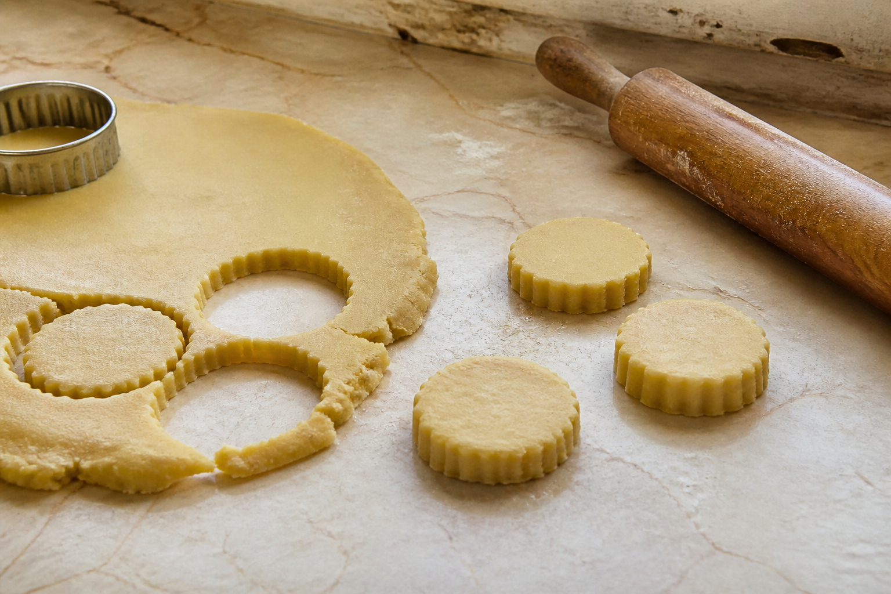
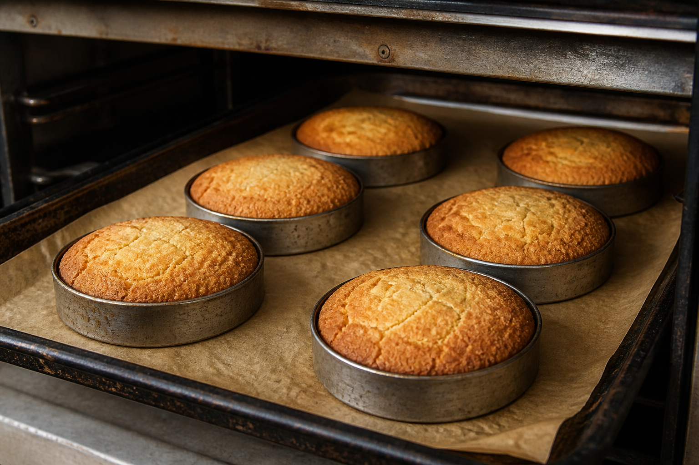
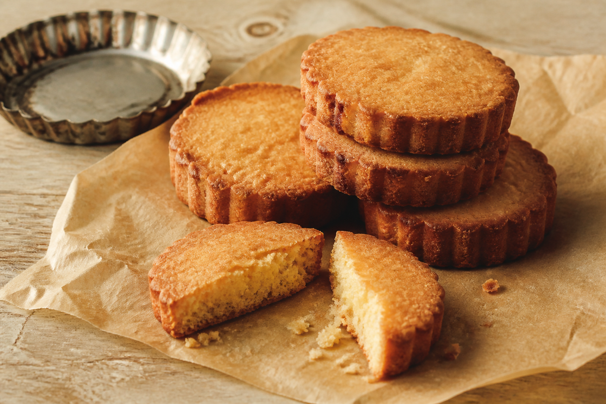

# No. 8. 사블레 브르통 — 사블레 브르통을 굽는 법

[← 2026년 8월호 메뉴](../../README.md) · [주차 목록](../README.md)

[잡지형 양면 편집으로 보기](../no-008_sable-breton-spread.html)

사블레 브르통은 프랑스 브르타뉴 지방의 두꺼운 버터 쿠키다. 일반적인 쿠키보다 버터와 달걀노른자의 비중이 높고, 소금을 더해 단맛과 고소함을 선명하게 만든다.

부드럽게 푼 버터에 달걀노른자와 설탕을 섞고 밀가루와 베이킹파우더를 넣는다. 반죽은 오래 치대지 않고 재료가 한 덩어리가 되는 순간 멈춘다. 냉장고에서 충분히 쉬게 하면 버터가 다시 단단해져 모양을 깔끔하게 자를 수 있다.

차가워진 반죽을 두껍게 밀어 원형으로 자른 뒤 작은 틀 안에서 굽는다. 틀은 옆으로 퍼지는 반죽을 잡아주고, 베이킹파우더와 버터의 수분은 반죽을 가볍게 부풀린다. 가장자리는 먼저 짙은 황금색으로 익고 가운데에는 밝은 버터색이 남는다.

오븐에서 꺼낸 직후에는 아직 부드럽지만 한김 식으면 표면이 단단해진다. 가장자리는 바삭하고 속은 포슬포슬하게 부서진다. 짭조름한 버터 향 뒤로 달걀노른자의 고소함과 구운 설탕의 단맛이 이어진다.

`Sablé`는 모래처럼 부서지는 식감을 가리킨다. 사블레 브르통은 화려한 장식 없이 반죽의 두께, 굽는 색, 부스러지는 정도만으로 완성도를 보여주는 과자다.
