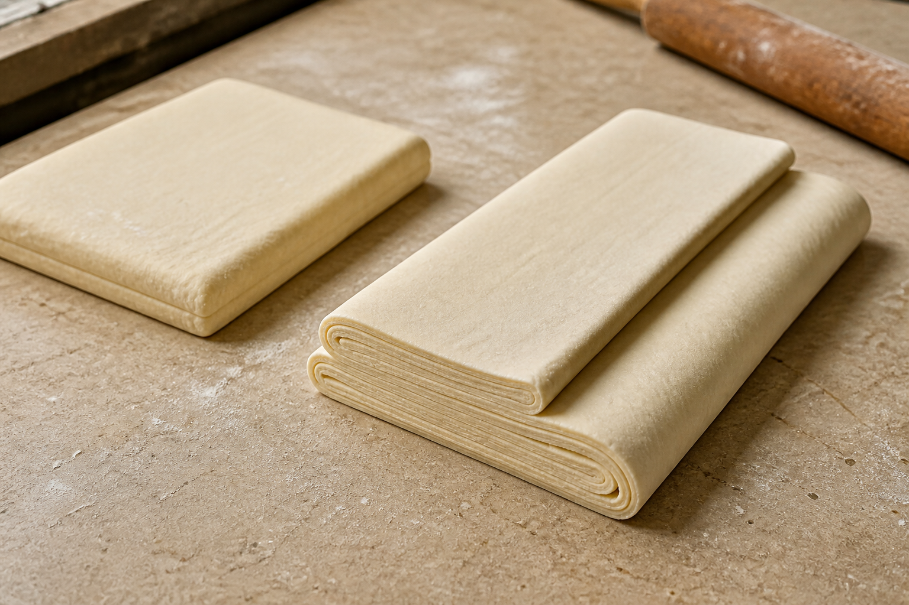
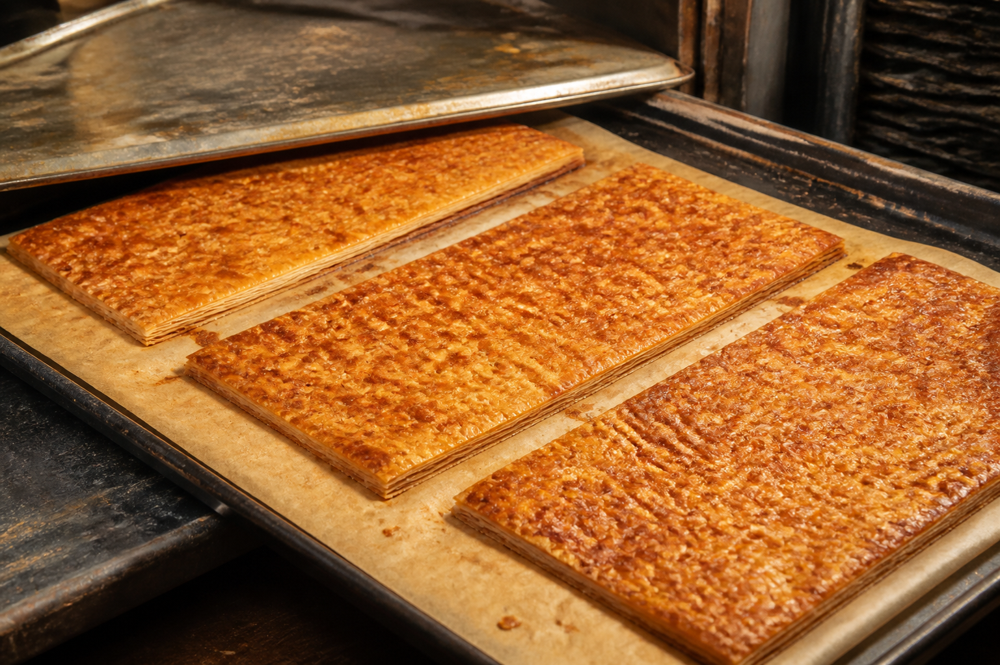
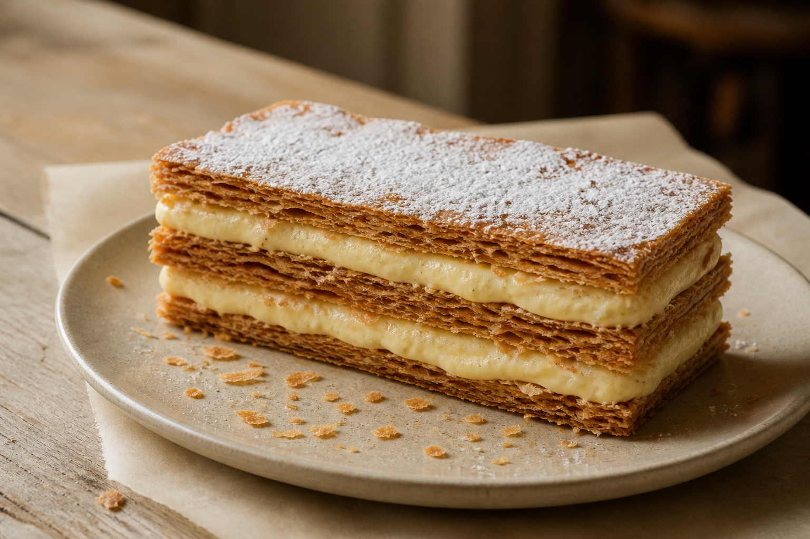

# No. 9. 밀푀유 — 밀푀유를 쌓는 법

[← 2026년 8월호 메뉴](../../README.md) · [주차 목록](../README.md)

[잡지형 양면 편집으로 보기](../no-009_mille-feuille-spread.html)

밀푀유의 기본은 세 장의 페이스트리와 그 사이를 채우는 두 층의 바닐라 크림이다. 같은 폭과 두께로 반복되는 직선, 짙게 구운 갈색과 밝은 크림색의 대비가 형태를 만든다.

밀가루 반죽 안에 차가운 버터를 넣고 길게 민 다음 접는다. 반죽을 다시 차갑게 쉬게 하고, 같은 과정을 반복하면 얇은 반죽과 버터가 규칙적으로 겹친다. 이 층들이 오븐에서 밀푀유의 바삭한 결이 된다.

얇게 민 생지에 고르게 구멍을 내고 두 장의 철판 사이에서 굽는다. 위 철판의 무게가 지나친 팽창을 막아 높이를 일정하게 유지한다. 다 구워진 생지에는 설탕을 얇게 뿌려 짧게 한 번 더 구우면 표면이 캐러멜화되고 바삭함이 오래 남는다.

완전히 식힌 페이스트리를 같은 크기의 직사각형 세 장으로 자른다. 첫 장에 바닐라 커스터드를 고르게 채우고 두 번째 장을 올린 뒤 같은 작업을 반복한다. 마지막 장을 덮고 슈거 파우더를 가볍게 뿌리면 기본적인 밀푀유가 완성된다.

포크가 닿으면 윗면이 먼저 얇게 깨지고 크림이 그 압력을 받아낸다. 바삭한 조각과 차갑고 부드러운 커스터드를 한입에 먹을 때 밀푀유의 식감이 완성된다. 화려한 장식보다 세 장과 두 층의 균형이 중요한 케이크다.
