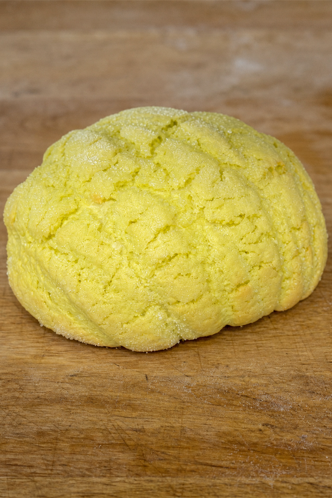

# minimirok 2026년 8월호

## 대중적인 세계 베이커리 기행

빵 한 조각에 남은 도시와 사람, 재료와 기술을 따라갑니다. 사진이나 메뉴 이름을 누르면 각 음식의 독립된 기록으로 이동합니다.

> No. 1–2는 발행 체계를 설계하기 위해 제작한 프로토타입입니다. 본 연재는 No. 3부터 시작합니다.

<table>
  <tr>
    <td align="center" valign="top" width="12%">
       
      No. 1 · TEST
    </td>
    <td align="center" valign="top" width="12%">
       
      No. 2 · TEST
    </td>
    <td align="center" valign="top" width="12%">
       
      No. 3
    </td>
    <td align="center" valign="top" width="12%">
       
      No. 4
    </td>
    <td align="center" valign="top" width="12%">
       
      No. 5
    </td>
    <td align="center" valign="top" width="12%">
       
      No. 6
    </td>
    <td align="center" valign="top" width="12%">
       
      No. 7
    </td>
    <td align="center" valign="top" width="12%">
       
      No. 8
    </td>
  </tr>
</table>

## Menu

| No. | 음식 | 구분 | 주차 | 기록 |
|---:|---|---|---|---|
| 1 | 갓나온 우유 식빵 | 프로토타입 | 7.27-8.2 | [열기](./7.27-8.2/md/no-001_fresh-milk-bread.md) |
| 2 | 메론빵 | 프로토타입 | 7.27-8.2 | [열기](./7.27-8.2/md/no-002_melon-bread.md) |
| 3 | 바게트 | 본편 | 8.3-8.9 | [열기](./8.3-8.9/md/no-003_baguette.md) |
| 4 | 마들렌 | 본편 | 8.3-8.9 | [열기](./8.3-8.9/md/no-004_madeleine.md) |
| 5 | 생크림 딸기 크루아상 | 본편 | 8.3-8.9 | [열기](./8.3-8.9/md/no-005_strawberry-cream-croissant.md) |
| 6 | 깜바뉴 | 본편 | 8.3-8.9 | [열기](./8.3-8.9/md/no-006_pain-de-campagne.md) |
| 7 | 눈꽃 몽블랑 | 본편 | 8.3-8.9 | [열기](./8.3-8.9/md/no-007_snow-mont-blanc.md) |
| 8 | 사블레 브르통 | 본편 | 8.3-8.9 | [열기](./8.3-8.9/md/no-008_sable-breton.md) |

## 주차별 인덱스

- [7.27-8.2 — No. 1–2](./7.27-8.2/README.md)
- [8.3-8.9 — No. 3–8](./8.3-8.9/README.md)
