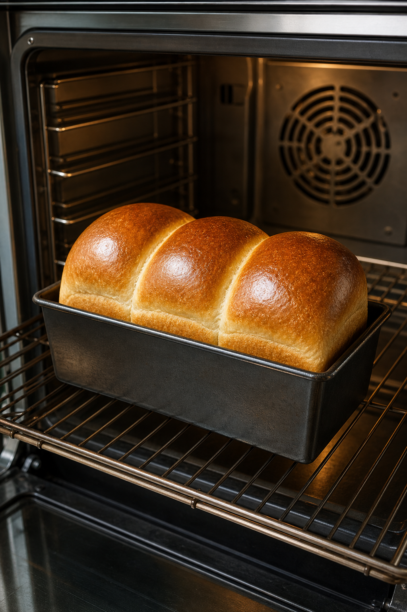

# minimirok 2026년 8월호

한 달의 음식 기록을 아홉 개의 창으로 먼저 바라봅니다. 각 사진을 누르면 해당 주차의 연재로 이어집니다.

<table>
  <tr>
    <td align="center" valign="top" width="33%">
       
      No. 1. 갓나온 우유 식빵
    </td>
    <td align="center" valign="top" width="33%">
       
      No. 2. 메론빵
    </td>
    <td align="center" valign="top" width="33%">
       
      No. 3. 바게트
    </td>
  </tr>
  <tr>
    <td align="center" valign="top" width="33%">
       
      No. 4. 마들렌
    </td>
    <td align="center" valign="top" width="33%">
       
      No. 5. 생크림 딸기 크루아상
    </td>
    <td align="center" valign="middle" width="33%">  No. 6. 다음 기록  </td>
  </tr>
  <tr>
    <td align="center" valign="middle" width="33%">  No. 7. 다음 기록  </td>
    <td align="center" valign="middle" width="33%">  No. 8. 다음 기록  </td>
    <td align="center" valign="middle" width="33%">  No. 9. 다음 기록  </td>
  </tr>
</table>

## 주차별 연재

- [7.27-8.2 — No. 1–2](./7.27-8.2/README.md)
- [8.3-8.9 — No. 3–5](./8.3-8.9/README.md)

[Idea Note](./ideanote.md)
