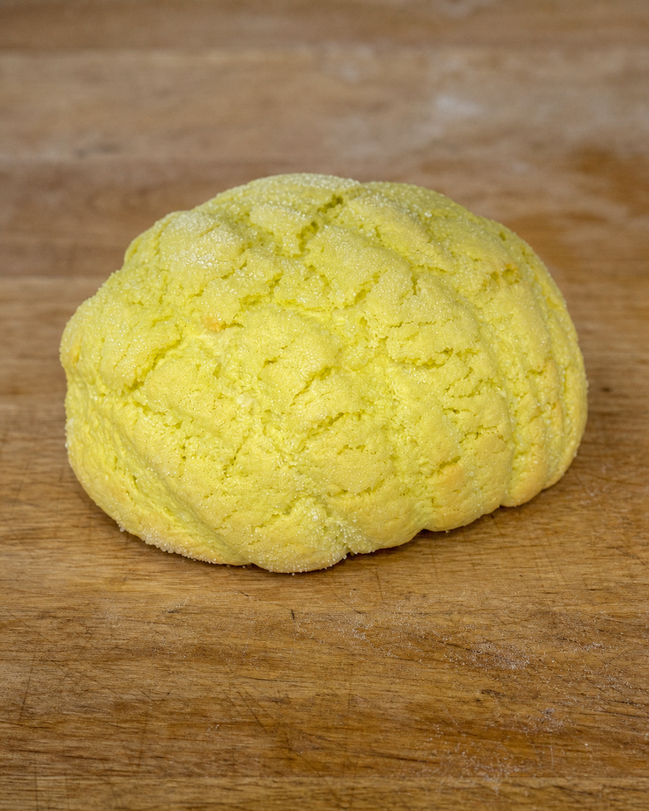
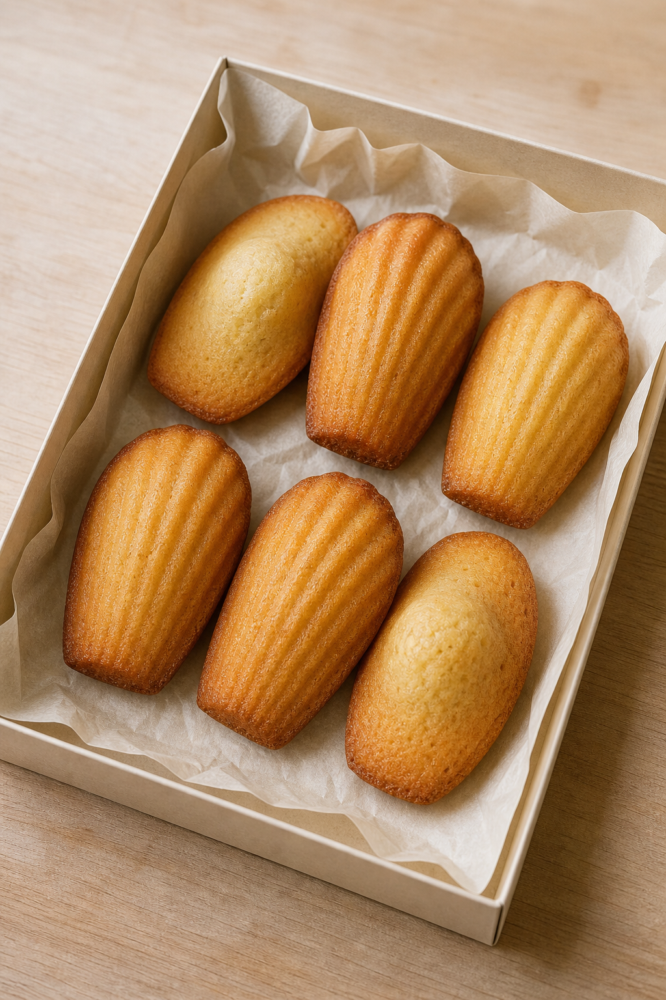

# minimirok 2026년 8월호

## No. 1. 갓나온 우유 식빵

베이커리의 가장 정석적인 빵인 우유 식빵으로 만미록의 첫 기록을 시작한다.

## No. 2. 메론빵

참고 빵의 비정형 외곽과 자연스럽게 갈라진 녹색 쿠키 껍질을 나무 도우판 위 실제 촬영 모드로 담은 메론빵.

## No. 3. 바게트

길고 가는 생지 위로 겹쳐 열린 칼집과 얇고 바삭한 껍질을 길쭉한 라탄 바구니 안에 담은 바게트.

## No. 4. 마들렌

베이지 포장지 안에 여섯 개를 가지런히 담고, 두 개를 뒤집어 실제 마들렌의 봉긋한 배꼽과 은은한 레몬 향을 표현한 마들렌.

